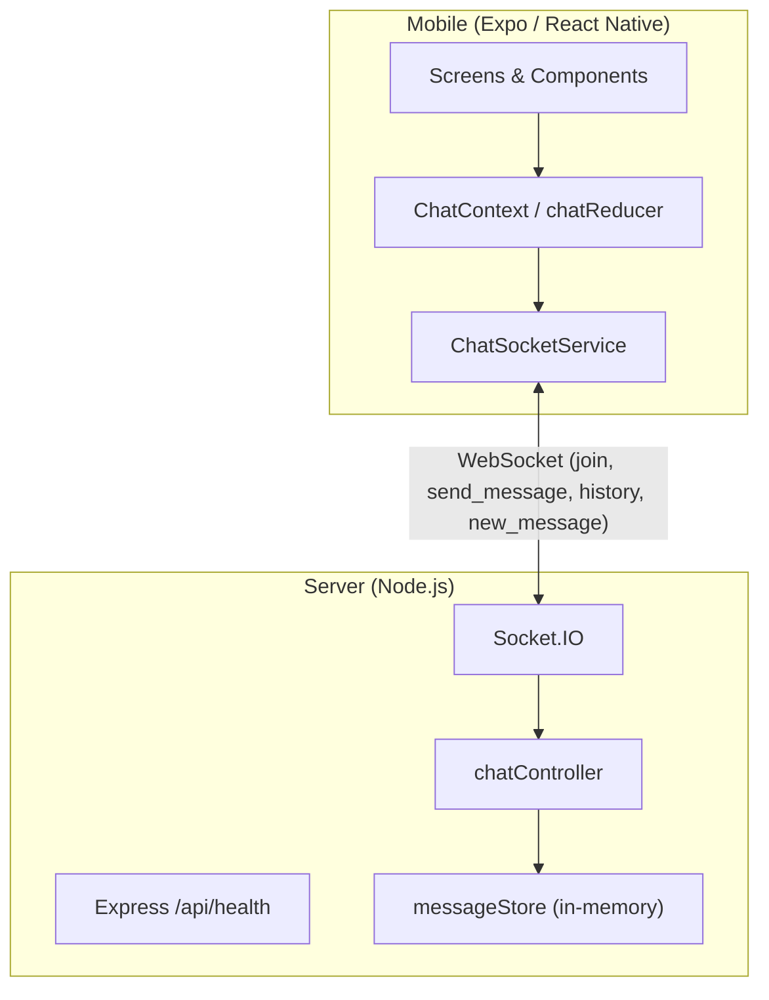

# PulseChat

PulseChat is a real-time chat application built as an npm monorepo. A Node.js backend handles message delivery over WebSockets, and a React Native mobile client connects to a single shared room.

The project is intentionally small: one chat room, username-only sign-in, and in-memory message storage. That scope keeps the codebase easy to run locally and straightforward to extend.

## Features

- Real-time messaging over Socket.IO
- Single global chat room
- Username-based entry (no account system)
- Message history on join (last 200 messages)
- Automatic connect and reconnect on the mobile client
- Connection status in the header and offline/reconnecting banner
- Input validation for usernames and message length
- Health check endpoint for the backend

## Architecture

PulseChat splits into two packages: `@pulsechat/server` and `@pulsechat/mobile`. Communication between them happens entirely over Socket.IO. The server also exposes a small REST surface for health checks.

### Message flow

1. The mobile client opens a WebSocket connection to the server.
2. After connecting, the client emits `join` with a locally generated `userId` and chosen username.
3. The server validates the payload, stores session data on the socket, sends `history`, and broadcasts `user_joined` to other clients.
4. When a user sends a message, the client emits `send_message`. The server validates it, persists it in memory, and broadcasts `new_message` to all connected clients.
5. On disconnect, the server broadcasts `user_left` if the socket had joined.

### Mobile client layers

The mobile app keeps transport, state, and UI separate:

- **Socket service** (`ChatSocketService`) — connection lifecycle, event wiring, emits
- **Application state** (`ChatContext`, `chatReducer`) — messages, connection status, send validation
- **UI** — screens and components with no socket or business logic

### Diagram



### Socket events

| Direction | Event | Payload |
|-----------|-------|---------|
| Client → Server | `join` | `{ userId, username }` |
| Client → Server | `send_message` | `{ userId, username, text }` |
| Server → Client | `history` | `{ messages: Message[] }` |
| Server → Client | `new_message` | `{ message: Message }` |
| Server → Client | `user_joined` | `{ user: { userId, username } }` |
| Server → Client | `user_left` | `{ user: { userId, username } }` |
| Server → Client | `error` | `{ message: string }` |

## Technology Stack

| Layer | Technologies |
|-------|--------------|
| Mobile | React Native 0.86, Expo 57, TypeScript, React Navigation, Socket.IO Client |
| Server | Node.js 18+, Express 4, Socket.IO 4, TypeScript |
| Tooling | npm workspaces, ESLint, Prettier, tsx (server dev), tsc-alias (server build) |

## Folder Structure

```
PulseChat/
├── mobile/                     # @pulsechat/mobile
│   ├── App.tsx                 # App entry, providers
│   ├── app.json                # Expo configuration
│   └── src/
│       ├── components/         # UI components
│       │   └── ui/             # Shared primitives (buttons, layout)
│       ├── config/             # Constants, env, connection status copy
│       ├── context/            # SessionContext, ChatContext
│       ├── hooks/              # useAutoScrollToEnd, etc.
│       ├── navigation/         # React Navigation stack
│       ├── screens/            # Splash, Login, Chat
│       ├── services/           # ChatSocketService
│       ├── state/              # chatReducer
│       ├── theme/              # Colors, spacing, typography
│       ├── types/              # Shared TypeScript types
│       └── utils/              # Validation, formatting, ID generation
├── server/                     # @pulsechat/server
│   └── src/
│       ├── config/             # Environment and constants
│       ├── controllers/        # Join and message handling logic
│       ├── routes/             # Express routes (/api/health)
│       ├── socket/             # Socket.IO handler registration
│       │   └── handlers/       # join, message, disconnect
│       ├── types/              # Shared TypeScript types
│       ├── utils/              # Message store, validation, logging
│       ├── app.ts              # Express app setup
│       └── index.ts            # HTTP + Socket.IO bootstrap
├── eslint.config.mjs
├── package.json                # Workspace root
└── README.md
```

Both packages use `@/` as an alias for `src/`:

- **Server:** resolved at build time via `tsc-alias`
- **Mobile:** resolved at runtime via `babel-plugin-module-resolver`

## Setup

**Prerequisites**

- Node.js 18 or later
- npm 9 or later
- For the mobile app: Expo Go on a device/simulator, or Android Studio / Xcode for native builds

**Install dependencies**

From the repository root:

```bash
npm install
```

## Running Backend

**Development** (watch mode with tsx):

```bash
npm run dev:server
```

The server listens on port `3001` by default. Verify it is up:

```bash
curl http://localhost:3001/api/health
```

Expected response:

```json
{ "status": "ok" }
```

**Production build**

```bash
npm run build:server
npm run start --workspace @pulsechat/server
```

**Environment variables**

| Variable | Default | Description |
|----------|---------|-------------|
| `PORT` | `3001` | HTTP and Socket.IO port |
| `CLIENT_ORIGIN` | `*` | CORS origin for Express and Socket.IO |
| `NODE_ENV` | — | Set to `production` in deployed environments |

## Running Mobile

**Start the Expo dev server**

```bash
npm run dev:mobile
```

Then open the app in Expo Go (scan the QR code), or press `a` for Android emulator / `i` for iOS simulator.

**Platform-specific server URL**

The mobile client needs to reach the backend. Defaults:

| Platform | Default URL |
|----------|-------------|
| iOS simulator | `http://localhost:3001` |
| Android emulator | `http://10.0.2.2:3001` |
| Physical device | Your machine's LAN IP (see below) |

For a physical device, set the server URL explicitly:

```bash
EXPO_PUBLIC_SERVER_URL=http://192.168.x.x:3001 npm run dev:mobile
```

Replace `192.168.x.x` with your development machine's local IP address. The backend must be running and reachable on that address.

**Other mobile scripts**

```bash
npm run android --workspace @pulsechat/mobile
npm run ios --workspace @pulsechat/mobile
```

## Design Decisions

**Monorepo with npm workspaces.** The server and mobile client share no runtime code, but living in one repository keeps versions, tooling, and documentation in one place.

**In-memory message store.** Messages are held in a process-local array capped at 200 entries. There is no database dependency, which simplifies local development. Messages are lost on server restart.

**No authentication.** Users pick a display name and receive a client-generated UUID. There is no verification of identity. This is sufficient for a single-room demo but not for production use without additional work.

**WebSocket-only transport on mobile.** The client connects with `transports: ["websocket"]` to avoid long-polling fallback. This keeps connection behavior predictable on mobile networks.

**Layered mobile architecture.** Socket handling, state management, and UI are in separate modules. Validation logic lives in `utils/` and is shared between UI affordances (disabled send button) and the context layer (actual send gate).

**Graceful reconnection.** The mobile client reconnects indefinitely with backoff. On reconnect it re-emits `join`, receives fresh history, and restores the connected state. Existing messages stay visible while offline; sending is disabled until the connection returns.

**Validation at the boundary.** Both client and server validate usernames and message text. Server validation is authoritative; client validation provides immediate feedback.

## Future Improvements

These are natural next steps if the project grows beyond its current scope:

- Persistent storage (PostgreSQL, Redis, or similar) with message retention policies
- User authentication and session management
- Multiple rooms or direct messages
- Presence indicators wired to `user_joined` / `user_left` on the mobile client
- Message delivery acknowledgements and offline queueing
- Rate limiting and abuse prevention on the server
- TLS and stricter CORS configuration for deployed environments
- End-to-end tests covering the socket protocol
- CI pipeline running typecheck, lint, and build across workspaces

## Root Scripts

| Command | Description |
|---------|-------------|
| `npm run dev:server` | Start backend in watch mode |
| `npm run dev:mobile` | Start Expo dev server |
| `npm run build:server` | Compile backend to `server/dist` |
| `npm run typecheck` | Type-check all workspaces |
| `npm run lint` | Lint all workspaces |
| `npm run format` | Format with Prettier |
| `npm run format:check` | Check Prettier formatting |

## License

MIT License. See [LICENSE](LICENSE) for details.
